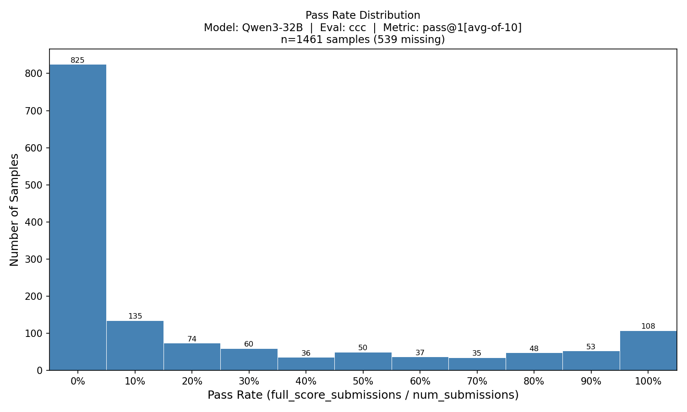

# Description

Competitive coding resource server.

## Training config

Define server-specific runtime knobs on the resource server config, then read
them from `self.config` in `app.py`. For this server the relevant config path is:

`env.nemo_gym.competitive_coding_challenges_resources_server.resources_servers.competitive_coding_challenges`

Example override from NeMo RL:

```bash
uv run python examples/nemo_gym/run_grpo_nemo_gym.py --config path/to/grpo.yaml \
  env.nemo_gym.config_paths='[responses_api_models/vllm_model/configs/vllm_model_for_training.yaml,resources_servers/competitive_coding_challenges/configs/competitive_coding_challenges.yaml,responses_api_agents/simple_agent/configs/simple_agent.yaml]'
```

Please see the resource server yaml for settings that can be modified such as:
```yaml
competitive_coding_challenges
    test_file: ${oc.env:CCC_TEST_FILE,data/test_metadata.jsonl}
    test_batch_size: 32
    num_parallel_requests: 16
    time_scale: 2.0
    shared_dir: ${oc.env:SHARED_TEMP_DIR,/tmp}
```

You must set the following at runtime:
- `export SHARED_TEMP_DIR=` local directory for code execution to store compilation files and share between ray instances and nodes
- `export CCC_TEST_FILE=` path to metadata.jsonl file which contains data test cases and necessary execution artifacts

and optionally can set to following:
- `export CCC_LOG_JSONL_PATH=` set path to view generations and runtime/compilation information (ex: stderr, stdout)
- `test_batch_size` per problem test case parallelism
- `num_parallel_requests` number of problems to evaluate in parallel
- `time_scale` timeout limit factor, multiply's each problem's inherent time limit

One can also override via the config, ex: `++env.nemo_gym.competitive_coding_challenges_resources_server.resources_servers.competitive_coding_challenges.test_file=`.

## Generating Rollouts

The following allows users to launch the environment followed by the request for generating and collecting rollouts.
```bash
ng_run "+config_paths=[$config_paths]" \
  +simple_agent.responses_api_agents.simple_agent.resources_server.name=competitive_coding_challenges_resources_server

ng_collect_rollouts +agent_name=simple_agent \
  +input_jsonl_fpath=$input_jsonl_fpath \
  +output_jsonl_fpath=$output_jsonl_fpath \
  +limit=null \
  +num_repeats=1 \
  +num_samples_in_parallel=null
```

## Additional Information

- Example reward profiling done with Qwen3-32B can be found at 
- The default settings for `test_batch_size`, `num_parallel_requests` and `time_scale` should work well but if you notice many `"run_stderr": "Time limit exceeded` in your `ccc_verify.jsonl` file then its worth increasing this to remove false negatives. Conversely, lowering `time_scale` will speed up training.
