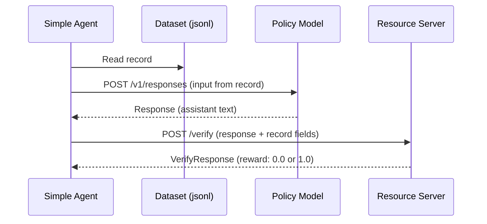
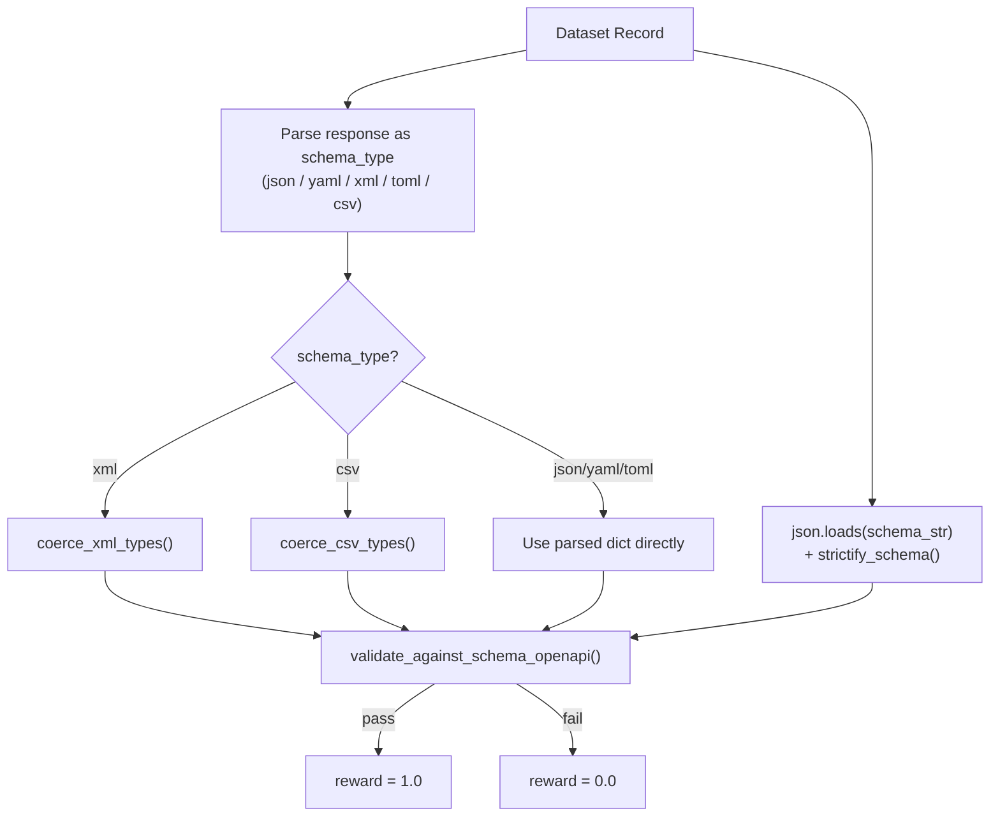
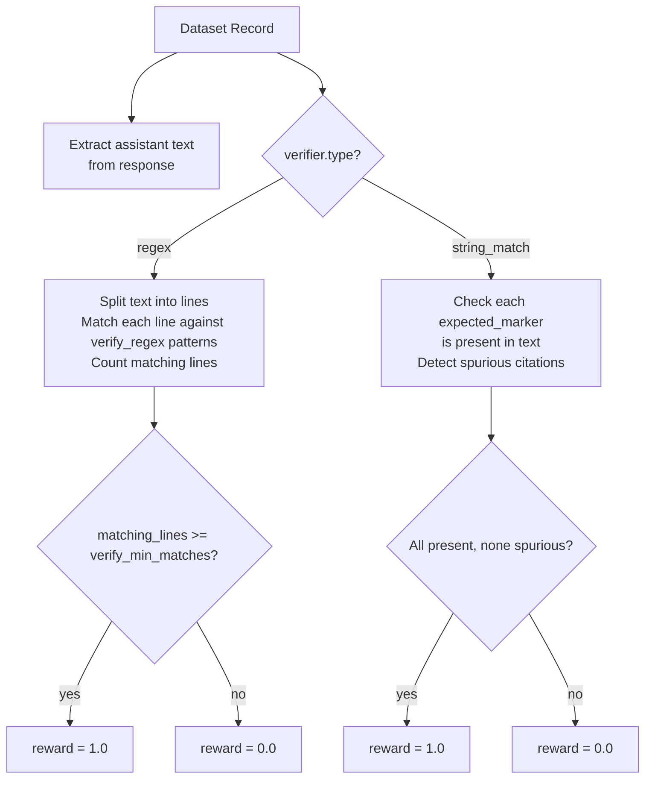

# Instruction-Following Environments: System Architecture

This document covers three Gym environments for instruction-following data:

| Environment | Resource Server | Dataset | Verify Method |
|---|---|---|---|
| Schema Adherence (ds1) | `structured_outputs` | 51 records, 5 formats (json/yaml/xml/toml/csv) | JSON Schema validation |
| Freeform Formatting (ds2) | `format_verification` | 55 records, 23 pattern types | Regex line matching |
| Citation Format (ds3) | `format_verification` | 96 records, 9 reference styles | String marker matching |

## High-Level Flow

All three environments follow the same Gym loop:

## structured_outputs Server (ds1)

Validates that model output parses as the target format and conforms to a JSON Schema.

### Field Mapping

| Dataset Record | VerifyRequest Field | Description |
|---|---|---|
| `messages` (non-assistant) | `responses_create_params.input` | Model prompt |
| `structured_schema` (converted to JSON) | `schema_str` | JSON Schema string |
| `target_output_format` | `schema_type` | One of: json, yaml, xml, toml, csv |

### Format Coverage

| Format | Count | Parsing | Validation | Type Coercion |
|---|---|---|---|---|
| json | 18 | `json.loads` | JSON Schema | No |
| xml | 17 | `xmltodict.parse` | JSON Schema | `coerce_xml_types` |
| csv | 7 | `csv.DictReader` | JSON Schema | `coerce_csv_types` |
| yaml | 7 | `yaml.safe_load` | JSON Schema | No |
| toml | 2 | `tomllib.loads` | JSON Schema | No |

## format_verification Server (ds2 + ds3)

A single server that dispatches on `verifier.type` to handle both freeform formatting and citation checking.

### ds2: Freeform Formatting (regex verifier)

| Dataset Record | VerifyRequest Field | Description |
|---|---|---|
| `messages` (non-assistant) | `responses_create_params.input` | Model prompt with formatting instructions |
| `verifier.verify_regex` | `verifier` | List of regex patterns to match |
| `verifier.verify_min_matches` | `verifier` | Minimum number of matching lines |

Pattern categories in the dataset: bullets (asterisk, dash, arrow, double-dash), numbered (dot, letter, roman, paren), headings (hash, equals, underline, caps), key-value (colon, arrow, equals, quoted), tables (markdown, pipe), delimiters (hr), mixed, and web-style formats.

### ds3: Citation Format (string_match verifier)

| Dataset Record | VerifyRequest Field | Description |
|---|---|---|
| `messages` (non-assistant) | `responses_create_params.input` | Model prompt with citation instructions |
| `verifier.expected_markers` | `verifier` | List of expected citation strings |
| `verifier.patterns` | `verifier` | Regex patterns for detecting all citations |

Reference styles in the dataset: `[ref:N]`, `<ref:N>`, `{ref:N}`, `[source:N]`, `[web:N]`, `[N]`, `<<N>>`, `(Part N)`, `(ref N)`.
