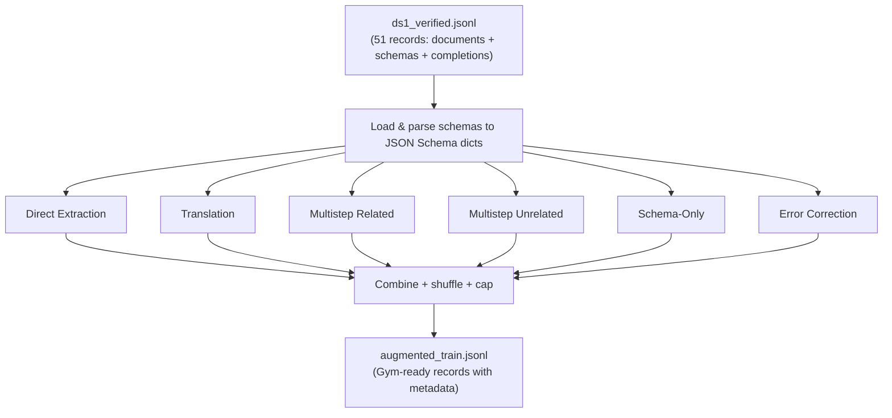

# Augmented SDG Pipeline for Structured Outputs RL Training

## Overview

This pipeline takes verified structured output data (documents + schemas + completions) and generates augmented Gym-ready training prompts across 6 problem categories. The goal is to produce diverse RL training data that exercises different aspects of schema adherence.

## Data Flow



## Input

`ds1_verified.jsonl` -- each record has:

| Field | Description |
|---|---|
| `document` | Source text to extract from |
| `structured_schema` | Schema in native format (JSON/YAML/TOML/XML/CSV) |
| `target_output_format` | Original output format |
| `messages` | `[{role: user, content: ...}, {role: assistant, content: ...}]` |
| `target_output` | The ground-truth structured output |

## Output

Each generated record:

```json
{
    "responses_create_params": {"input": [{"role": "user", "content": "..."}]},
    "schema_str": "{\"type\": \"object\", ...}",
    "schema_type": "json",
    "problem_type": "direct",
    "schema_repr": "yaml",
    "source_format": null,
    "num_turns": 1,
    "source_record_id": "DS1-64502D8C"
}
```

## Problem Categories

### 1. Direct Extraction (`direct`)

Standard extraction: document + schema + instruction -> structured output.

Varies:
- **Target format**: json, yaml, xml, toml, csv
- **Schema representation**: json, yaml, python, native
- **Instruction style**: 6+ templates per format
- **Document layout**: 7 templates (instructions before/after document)
- **Message layout**: 5 arrangements (system+user, single user, split user, etc.)

**Example prompt:**
```
Format your response as valid YAML matching the provided schema:
type: object
properties:
  name:
    type: string
  population:
    type: integer

Extract the information from the text and format it according to the schema.

Document:
Santa Rosa del Jilguero is a town in the municipality of San Martín de Hidalgo...
```

### 2. Translation (`translation`)

Given a completed output in format X, translate to format Y.

**Example prompt:**
```
Here is data in JSON:

{"name": "Santa Rosa del Jilguero", "population": 47}

Schema: {"type": "object", "properties": {"name": {"type": "string"}, "population": {"type": "integer"}}}

Convert this into YAML format.
```

### 3. Related Multistep (`multistep_related`)

Turn 1: original question + answer. Turn 2: follow-up format conversion.

**Example prompt:**
```
User: [original extraction question]
Assistant: {"name": "Santa Rosa", "population": 47}
User: Now convert your response to XML format. The schema is: {...}
```

### 4. Unrelated Multistep (`multistep_unrelated`)

History from record A (irrelevant context), then a new extraction from record B.

Tests the model's ability to follow the latest instruction despite unrelated conversation history.

### 5. Schema-Only Generation (`schema_only`)

No document. Just a schema. The model must generate realistic data.

**Example prompt:**
```
Generate a realistic example that conforms to this JSON schema:

{"type": "object", "properties": {"name": {"type": "string"}, "age": {"type": "integer"}}}
```

### 6. Error Correction (`error_correction`)

A corrupted structured output + schema. The model must fix it.

Corruption types:
- Drop a required field
- Change a value's type (int -> string)
- Add an unexpected extra field
- Break syntax (invalid JSON)

**Example prompt:**
```
The following JSON output has errors. Fix it to conform to the schema.

Schema: {"type": "object", "properties": {"name": {"type": "string"}, "age": {"type": "integer"}}, "required": ["name", "age"]}

Broken output:
{"name": "Alice", "age": "twenty-five", "_unexpected_field": "oops"}
```

## Schema Representation Modes

When presenting a schema in the prompt, we randomly pick one of:

| Mode | Description | Safe? |
|---|---|---|
| `json` | `json.dumps(schema)` | Always |
| `yaml` | `yaml.dump(schema)` | Always (lossless round-trip) |
| `python` | `repr(schema)` (single quotes, True/False) | Always |
| `native` | Original `structured_schema` string from source data | Always (pre-verified) |

TOML/XML/CSV are NOT used as schema representations because they're lossy.

## Volume Controls

The pipeline can generate a LOT of data. Use these knobs:

| Flag | Default | Description |
|---|---|---|
| `--max-total` | 5000 | Hard cap on total output records |
| `--max-per-category` | 1000 | Cap per problem category |
| `--samples-per-record` | 3 | Augmented samples per source record (ignored in unique mode) |
| `--category-weights` | equal | Relative mix ratio, e.g. `direct:4,translation:2`. Also filters: only listed categories are generated |
| `--no-unique` | off | Allow reusing source records across categories. Default is unique mode: each record used at most once (partitioned across categories). `multistep_unrelated` is exempt since it pairs records |
| `--passthrough-ratio` | 0.3 | Fraction of `direct` samples that use original messages as-is instead of re-templating |
| `--max-history-turns` | 4 | Max unrelated history pairs in `multistep_unrelated` (so up to 5 total turns with the model response) |

**Unique mode** (default): 51 source records are partitioned across the 5 partitionable categories (~10 each), producing ~51 samples + multistep_unrelated samples. Use `--no-unique` for more data with record reuse.

## CLI Examples

```bash
# Default (unique mode, ~50-100 samples)
python 260409_augmented_sdg.py \
    -i /path/to/ds1_verified.jsonl \
    -o data/augmented_train.jsonl

# Allow reuse for more data
python 260409_augmented_sdg.py \
    -i /path/to/ds1_verified.jsonl \
    -o data/augmented_train.jsonl \
    --no-unique --samples-per-record 3

# Single category only
python 260409_augmented_sdg.py \
    -i /path/to/ds1_verified.jsonl \
    -o data/direct_only.jsonl \
    --categories direct

# Single category via weights (equivalent)
python 260409_augmented_sdg.py \
    -i /path/to/ds1_verified.jsonl \
    -o data/multistep_only.jsonl \
    --category-weights "multistep_unrelated:1"

# JSON and YAML only
python 260409_augmented_sdg.py \
    -i /path/to/ds1_verified.jsonl \
    -o data/json_yaml_only.jsonl \
    --target-formats json,yaml

# More original messages, less re-templating
python 260409_augmented_sdg.py \
    -i /path/to/ds1_verified.jsonl \
    -o data/mostly_original.jsonl \
    --passthrough-ratio 0.7

# Longer multistep conversations (up to 7 total turns)
python 260409_augmented_sdg.py \
    -i /path/to/ds1_verified.jsonl \
    -o data/long_multistep.jsonl \
    --categories multistep_unrelated \
    --max-history-turns 6

# Weighted mix
python 260409_augmented_sdg.py \
    -i /path/to/ds1_verified.jsonl \
    -o data/weighted.jsonl \
    --no-unique --max-total 1000 \
    --category-weights "direct:4,translation:2,multistep_related:2,multistep_unrelated:1,schema_only:1,error_correction:1"
```

## Metadata in Rollouts

Every generated record carries metadata fields (`problem_type`, `schema_repr`, etc.) that flow through the Gym pipeline:

1. **Data record** -> `VerifyRequest` -> `VerifyResponse` -> **rollout jsonl**
2. `compute_metrics()` on the resource server automatically computes:
   - `mean/reward_{schema_type}` (json, yaml, xml, toml, csv)
   - `mean/reward_{problem_type}` (direct, translation, etc.)
   - `mean/reward_repr_{schema_repr}` (json, yaml, python, native)
3. Breakdown scripts can slice by any dimension with `--by-problem-type` / `--by-schema-repr`

## File Layout

```
misc/data_generation/
  260409_augmented_sdg.py      # main orchestrator + CLI
  260409_augmented_sdg.md      # this file
  templates.py                 # shared template banks
  generators/
    __init__.py                # registry of all generators
    direct.py                  # category 1 + 1b
    translation.py             # category 2
    multistep.py               # categories 3 + 4
    schema_only.py             # category 5
    error_correction.py        # category 6
```
