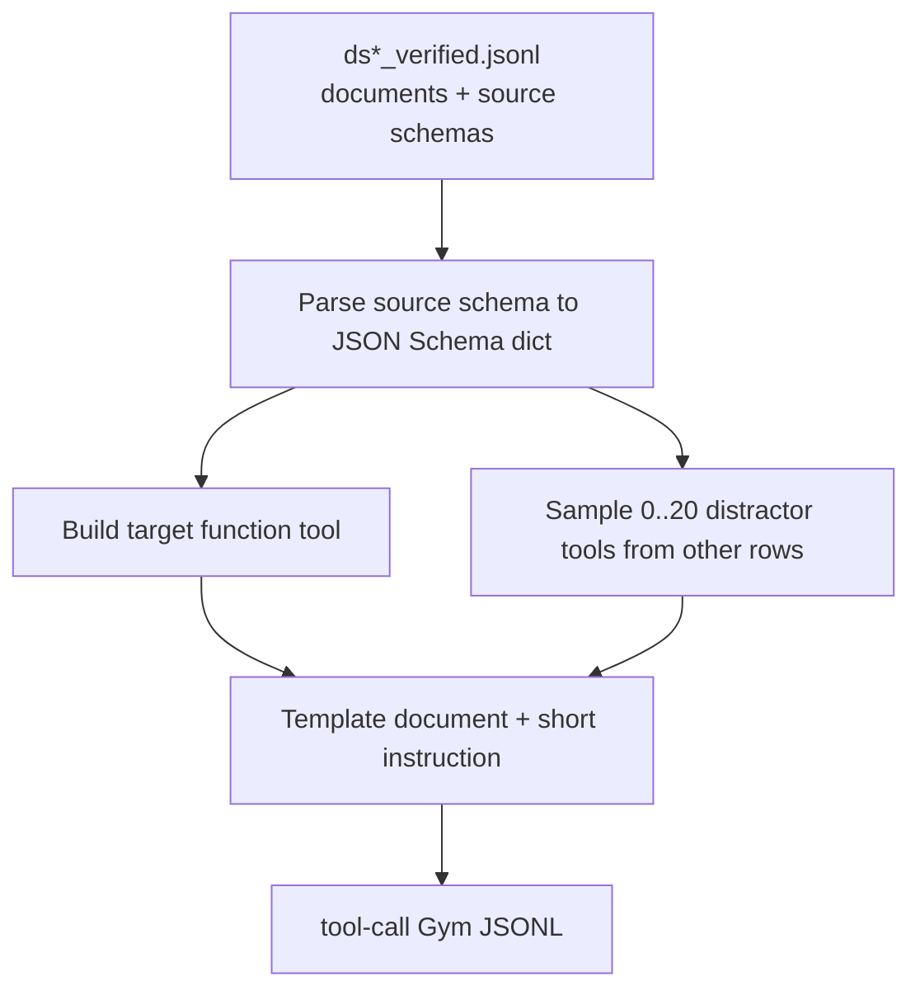

# Structured Outputs v4 Tool-Call SDG Pipeline

## Overview

This pipeline generates Gym-ready RL data for schema adherence through OpenAI
Responses API tool calls. Unlike v3, the prompt does not show the schema or ask
for JSON, YAML, XML, TOML, or CSV text. The model sees a document, a task
instruction, and one or more function tools. The target structured output must
be returned as function-call arguments.

## Data Flow



## Input

The input is the same verified data shape used by v3. Each row should include:

| Field | Description |
|---|---|
| `document` | Source text to extract from |
| `structured_schema` | Source schema in JSON/YAML/TOML/XML/CSV-backed representation |
| `target_output_format` | Source schema representation format |
| `metadata.record_id` | Optional stable source id |

The existing `messages` and `target_output` fields may be present but are not
used for v4 prompt construction.

## Output

Each generated row has a Responses API tool definition and verifier metadata:

```json
{
  "responses_create_params": {
    "input": [{"role": "user", "content": "Capture the key fields from the document in the appropriate function call.\n\nDocument:\n..."}],
    "tools": [
      {
        "type": "function",
        "name": "extract_record",
        "description": "Submit structured information extracted from the document.",
        "parameters": {"type": "object", "properties": {"field": {"type": "string"}}, "required": ["field"]},
        "strict": true
      }
    ],
    "tool_choice": "auto",
    "parallel_tool_calls": false
  },
  "schema_str": "{\"type\":\"object\",...}",
  "schema_type": "json",
  "response_mode": "tool_call",
  "problem_type": "direct_tool_call",
  "tool_choice": "auto",
  "parallel_tool_calls": false,
  "tool_name": "extract_record",
  "tool_schema_mode": "direct",
  "tool_payload_key": null,
  "tool_name_style": "semantic",
  "distractor_style": "none",
  "tool_union_mode": null,
  "num_tools": 1,
  "num_distractors": 0,
  "has_distractors": false,
  "instruction_layout": "user_instruction_before_document",
  "instruction_detail_level": "standard",
  "system_instruction_style": "none",
  "source_schema_type": "json",
  "source_record_id": "DS1-..."
}
```

## Prompt Templates

Prompts intentionally contain only document/task language. They do not include:

- schema strings
- schema representation names
- source target format names such as JSON, YAML, XML, TOML, or CSV
- examples of the expected output syntax

Instructions vary by detail level:

- `concise`: short commands such as "Return the relevant document facts with
  the tool."
- `standard`: one-sentence extraction instructions that name the document and
  function-call surface.
- `explicit`: more detailed instructions that say the tool call is the final
  answer and the arguments should be grounded in the document.

The instruction is randomly placed in layouts such as system prompt, before the
document, after the document, split system/user, or compact single-user message.
System prompts also vary between tool-required, tool-selection, no-prose, and
final-answer-surface phrasing.

## Tool Argument Shapes

The target schema is converted to an OpenAI function `parameters` schema. The
default argument-shape mix is:

During conversion, the generator also normalizes source-schema quirks that are
common in the v3 corpus: non-array `enum` containers are flattened to JSON
Schema enum arrays, `nullable` is converted into a `null` type union, `format`
annotations are stripped, and local definition refs are emitted through
`$defs`. Invalid scalar entries inside a `properties` map are dropped, since
JSON Schema property values must be schema objects or booleans. Bool-like
strings on schema keywords such as `additionalProperties` are converted to
booleans.

There are two schema surfaces in v4:

- `schema_str` uses the strictified schema for reward verification. This keeps
  all declared fields required and closes objects with `additionalProperties:
  false`.
- `responses_create_params.tools[].parameters` uses a vLLM-compatible version
  of that schema. It removes boolean `additionalProperties` /
  `additionalItems` and replaces remaining boolean schema nodes with `{}` so
  vanilla vLLM/Outlines can compile the tool grammar.

The vLLM compatibility transform is done in data generation, not in the shared
Responses-to-Chat converter. See `vllm-tool-schema-compatibility.md`.

| Mode | Probability | Shape |
|---|---:|---|
| `direct` | 10% | Use the object schema directly as function parameters |
| `extraction_wrapper` | 35% | Wrap under required key `extraction` |
| `random_wrapper` | 55% | Wrap under a sampled key such as `output`, `result`, `record`, `data`, `answer`, or `summary` |

If the validation schema is not object-shaped, wrapper mode is forced because
OpenAI function parameters must be object-shaped.

## Tool Names

Tool names are varied. The default semantic pool keeps the original names:

- `submit_structured_output`
- `extract_record`
- `record_answer`
- `summarize_document`
- `populate_schema`

It also adds shorter and domain-generic names such as `extraction`, `extract`,
`summary`, `structured_output`, `document_summary`, and
`extract_structured_data`.

Some rows use numbered tool names instead, for example `extraction_tool_1`,
`extraction_tool_2`, or `structured_output_tool_3`. This is controlled by
`--tool-name-style-weights`.

## Distractor Tools

Rows can include distractor schemas sampled from other source rows. The target
is tracked by `tool_name` and, when needed, `tool_payload_key`.

The default train distractor-count distribution is explicit rather than
geometric:

```text
0:1,1:1,2:1,3:1,4:1,5:2,6:2,7:3,8:4,9:5,
10:7,11:8,12:10,13:11,14:12,15:12,16:10,17:8,18:6,19:4,20:3
```

This centers the data around 12..16 distractors. Small 0..4 distractor cases
remain as anchors, and 17..20 distractor cases remain as a hard tail. Passing
an empty `--distractor-count-weights` string falls back to the older
`--no-distractor-ratio` plus geometric sampling knobs.

For rows with at least one distractor, the default style weights emphasize
separate and numbered tools. A single-tool multi-key object slice remains
because it tests single-tool schema selection without relying on `oneOf` /
`anyOf` composition. The current default weights are:

```text
separate_tools:35,numbered_tools:35,single_tool_multi_key:30
```

The union-style branches remain supported by CLI overrides for targeted
compatibility probes, but they are not part of the default train blend. In
shape probes, inline `oneOf`, inline `anyOf`, `$defs` + `oneOf`, `$defs` +
`anyOf`, and `$defs`-only multi-branch schemas produced invalid typed tool
arguments. The dominant failure was that the model placed a JSON string inside
the selected payload key instead of passing an object or array directly.

By default, rows use `tool_choice: auto`. The generator samples
`parallel_tool_calls: true` for 25% of rows unless `--parallel-tool-calls` is
passed to force a single value. This request setting is coverage only: the
verifier still gives reward only when the model emits exactly one function
call.

`tool_choice: auto` is intentional for v4. With vLLM, `tool_choice: required`
routes through vLLM's internal structured-output constrained-decoding path for
forced tool calls. That is not the target surface for this dataset: v4 should
test whether the model chooses and emits the correct tool call, while the
verifier decides whether missing, multiple, or malformed tool calls receive
reward. `auto` also matches rows where the document may contain little or
nothing useful to extract.

Distractors are rendered in several styles:

| Style | Behavior |
|---|---|
| `none` | No distractors; emit only the target function tool |
| `separate_tools` | Target and distractors are separate function tools with semantic names |
| `numbered_tools` | Target and distractors are separate function tools named like `extraction_tool_1` |
| `single_tool_multi_key` | One function tool whose top-level properties are branch payload keys, without `oneOf` / `anyOf` composition |
| `single_tool_oneof` | One function tool whose parameters use inline `oneOf` branches |
| `single_tool_anyof` | One function tool whose parameters use inline `anyOf` branches |
| `single_tool_defs_oneof` | One function tool whose parameters use `$defs` plus `oneOf` |
| `single_tool_defs_anyof` | One function tool whose parameters use `$defs` plus `anyOf` |

For single-tool multi-branch styles, each branch uses a different payload key
such as `extraction`, `summary`, `structured_output`, `record`, or
`document_info`. The verifier only accepts the target branch key. Multi-branch
styles are used only when there is at least one real distractor branch;
no-distractor rows use a plain single target tool.

The `single_tool_oneof`, `single_tool_anyof`, `single_tool_defs_oneof`, and
`single_tool_defs_anyof` styles are diagnostic modes. They are kept for targeted
schema-composition probes, not used by the default train blend.

## CLI Examples

```bash
# Small smoke run
python resources_servers/structured_outputs/misc/data_generation/structured_outputs_v4/260424_tool_call_sdg.py \
    -i /path/to/ds1_verified.jsonl \
    -o /tmp/structured_outputs_v4_smoke.jsonl \
    --max-total 20

# Generate one sample for every loaded source row
python resources_servers/structured_outputs/misc/data_generation/structured_outputs_v4/260424_tool_call_sdg.py \
    -i /path/to/ds1_verified.jsonl \
    -o resources_servers/structured_outputs/data/structured_outputs_v4_tool_call.jsonl

# Generate multiple variants per source row
python resources_servers/structured_outputs/misc/data_generation/structured_outputs_v4/260424_tool_call_sdg.py \
    -i /path/to/ds1_verified.jsonl \
    -o resources_servers/structured_outputs/data/structured_outputs_v4_tool_call_large.jsonl \
    --samples-per-record 3

# Heavier distractor setting
python resources_servers/structured_outputs/misc/data_generation/structured_outputs_v4/260424_tool_call_sdg.py \
    -i /path/to/ds1_verified.jsonl \
    -o resources_servers/structured_outputs/data/ds1_tool_call_hard.jsonl \
    --distractor-count-weights "0:0,1:0,2:0,3:0,4:1,5:2,6:3,7:4,8:5,9:8,10:10,11:12,12:12,13:10,14:8,15:6,16:4,17:3,18:2,19:1,20:1" \
    --max-distractors 20

# Force union-style distractors only for compatibility experiments
python resources_servers/structured_outputs/misc/data_generation/structured_outputs_v4/260424_tool_call_sdg.py \
    -i /path/to/ds1_verified.jsonl \
    -o /tmp/union_tools.jsonl \
    --distractor-style-weights "single_tool_oneof:0.5,single_tool_defs_anyof:0.5"

# Force numbered tool names
python resources_servers/structured_outputs/misc/data_generation/structured_outputs_v4/260424_tool_call_sdg.py \
    -i /path/to/ds1_verified.jsonl \
    -o /tmp/numbered_tools.jsonl \
    --tool-name-style-weights "numbered:1"

# Change argument-shape mix
python resources_servers/structured_outputs/misc/data_generation/structured_outputs_v4/260424_tool_call_sdg.py \
    -i /path/to/ds1_verified.jsonl \
    -o /tmp/tool_modes.jsonl \
    --tool-schema-mode-weights "direct:0.25,extraction_wrapper:0.25,random_wrapper:0.50"
```

## Distribution Plot

Run the static tool-call JSONL sanity check after regenerating data:

```bash
python resources_servers/structured_outputs/misc/check_tool_call_jsonl.py \
    -i resources_servers/structured_outputs/data/structured_outputs_v4_tool_call.jsonl
```

This checks the row contract, target tool lookup, wrapper payload keys, JSON
schema strings, and vLLM-sensitive tool-parameter constructs such as boolean
schema nodes and `format` annotations.

Regenerate the train distribution image after remaking the train JSONL:

```bash
MPLCONFIGDIR=/tmp/matplotlib-cache \
python resources_servers/structured_outputs/misc/data_generation/structured_outputs_v4/plot_train_distribution.py
```

## Verifier Behavior

`resources_servers/structured_outputs/app.py` supports both text and tool-call
responses. For v4 rows, `response_mode` is `tool_call`, so verification:

1. finds a `function_call` whose `name` matches `tool_name`
2. JSON-decodes the function-call `arguments`
3. unwraps `tool_payload_key` when the row uses a wrapper mode
4. validates the resulting object against `schema_str`

Failure types include `missing_tool_call`, `wrong_tool_name`,
`tool_arguments_parse_error`, `missing_tool_payload_key`, `schema_error`, and
`validation_error`.

## Metrics

The resource server keeps the existing v3 breakdowns and adds v4-specific
reward means by:

- `response_mode`
- `tool_schema_mode`
- `num_tools`
- `has_distractors`
- `instruction_layout`
- `instruction_detail_level`
- `system_instruction_style`
- `tool_name_style`
- `distractor_style`
- `tool_union_mode`

## Scope Difference from v3

v4 is intentionally direct-generation-only. Translation, error correction,
schema-only generation, and multistep categories depend on showing or editing
schema/text outputs in the prompt, which is not the point of this tool-call
setting. This pipeline focuses on whether the model can choose the right tool
and produce arguments that conform to that tool schema.
